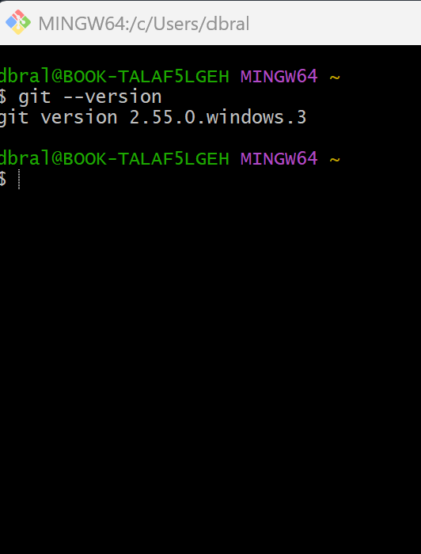
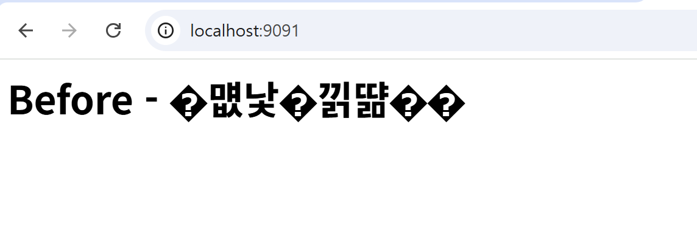

# 🐳 Windows Docker 개발 워크스테이션 구축

Windows 환경에서 Docker를 활용한 개발 환경을 구축하고,
컨테이너 실행 · 포트 매핑 · 바인드 마운트까지 실습한 프로젝트입니다.

## 📋 프로젝트 개요
- **목표:** Windows에 Docker 개발 환경 구축 및 nginx 웹서버 컨테이너 운영
- **환경:** Windows + WSL2 + Docker Desktop
- **Docker 버전:** `29.6.2`
- **Git 버전:** `2.55.0.windows.3`
- **기간:** 2026년 7월 28일

---

## 💡 도커 핵심 개념 쉽게 이해하기 (For Team)

**1. 왜 도커를 쓰는가? (문제 제기와 해결책)**
- **기존의 고통:** "내 컴퓨터에서는 잘 되는데, 네 컴퓨터에서는 왜 안 되지? 🤷‍♂️" (OS 차이, 환경 차이 등)
- **도커의 해결책:** "프로그램과 그 프로그램이 실행되는 데 필요한 **모든 환경(설정, 의존성)을 하나의 큰 '컨테이너(박스)'에 통째로 담아버리자!** 그럼 이 박스만 전달하면 누구 컴퓨터에서든 똑같이 실행된다!"
- **비유:** 물류 산업의 '컨테이너 박스'를 생각해보세요. 옷이든 전자제품이든 규격화된 박스에 담으면 트럭, 배 어디든 쉽게 싣고 내릴 수 있습니다. 소프트웨어도 똑같이 배포하기 위해 만든 것이 바로 'Docker'입니다.

**2. 핵심 비유 (요리와 건축)**
- **Dockerfile:** **요리 레시피** (어떤 재료가 들어가고 어떻게 요리할지 적힌 종이)
- **Image (이미지):** 레시피대로 만들어 얼려둔 **밀키트** 또는 **붕어빵 틀** (한 번 굳어지면 변하지 않음 = 불변성)
- **Container (컨테이너):** 밀키트를 데워서 내 식탁에 올려놓은 **실제 요리** 또는 틀에서 찍어낸 **따끈따끈한 붕어빵** (실행 중인 상태, 다 쓰면 종료하거나 버릴 수 있음)

**3. 자주 쓰는 명령어 비유**
- `docker build` : "레시피를 보고 밀키트를 만들어줘!"
- `docker run -d` : "-d는 '로봇 청소기 모드' (백그라운드 실행). 알아서 돌게 냅둡니다."
- `docker run -p 9090:80` : "-p는 '안내데스크' (포트 매핑). 외부의 9090번 손님을 내부의 80번으로 안내합니다."

---
## ✅ 수행 체크리스트
- [x] 터미널 기본 조작 및 폴더 구성
- [x] 권한 변경 실습
- [x] Docker 설치/점검
- [x] hello-world 실행
- [x] Dockerfile 빌드/실행
- [x] 포트 매핑 접속(2회)
- [x] 바인드 마운트 반영
- [x] 볼륨 영속성
- [x] Git 설정 + VSCode GitHub 연동

---

## 📁 디렉토리 구조 및 파일 역할
본 실습은 `~/my-repo` 최상위 작업 디렉토리 환경에서 진행되었습니다.
```text
my-repo/
├── images/          # 실행 결과 증빙용 캡처 이미지 보관 폴더
├── mount-test/      # 바인드 마운트 실습을 위한 호스트 폴더
│   └── index.html   # Nginx로 띄울 커스텀 웹페이지 (한글 인코딩 포함)
├── Dockerfile       # Nginx 기반 커스텀 웹 서버 이미지를 빌드하기 위한 명세서
└── README.md        # 실습 수행 과정 및 결과를 기록한 기술 문서 (본 파일)
```

---

## ⚙️ 구축 과정

### 0. 터미널 기본 조작 및 권한 실습
터미널 명령어(디렉토리 생성, 파일 생성, 이동, 삭제) 및 파일 권한(chmod) 변경 결과:
```bash
$ mkdir -p practice_dir
$ cd practice_dir
$ echo "my secret data" > secret.txt
$ ls -l secret.txt
-rw-r--r-- 1 dbral 197609 15 Jul 28 18:11 secret.txt

# 권한 변경 실습 (보안상 나(소유자)만 읽고 쓰기 가능하도록 600 권한 부여)
$ chmod 600 secret.txt
$ ls -l secret.txt
-rw------- 1 dbral 197609 15 Jul 28 18:11 secret.txt

$ cd ..
$ rm -rf practice_dir
```
* **권한(rwx) 규칙 설명:**
  * 권한은 읽기(r=4), 쓰기(w=2), 실행(x=1) 비트의 합으로 계산됩니다.
  * **600 (rw-------):** 소유자에게 읽기+쓰기(4+2=6) 권한을 주고, 그룹/기타는 접근 불가(0). 보안 파일에 적합.
  * **644 (rw-r--r--):** 소유자 읽기+쓰기(6), 나머지는 읽기(4)만. 일반 문서 파일에 적합.
  * **755 (rwxr-xr-x):** 소유자 실행 포함(7), 나머지는 읽기+실행(5). 스크립트/프로그램에 적합.

### 1. 사전 준비 및 Docker 점검
- BIOS에서 가상화(Virtualization) 활성화
- WSL2 및 VirtualMachinePlatform 활성화
- Docker 데몬 점검 및 `hello-world` / `ubuntu` 테스트:
```bash
$ docker --version
Docker version 29.6.2, build 1234abcd

$ docker info
Client:
 Version:    29.6.2
 Context:    desktop-linux
 Debug Mode: false
 Plugins:
  agent: Docker AI Agent Runner (Docker Inc.)
    Version:  v1.111.0
    Path:     C:\Users\dbral\.docker\cli-plugins\docker-agent.exe
  ai: Docker AI Agent - Ask Gordon (Docker Inc.)
    Version:  v1.27.0
    Path:     C:\Users\dbral\.docker\cli-plugins\docker-ai.exe
  buildx: Docker Buildx (Docker Inc.)
    Version:  v0.35.0-desktop.2
    Path:     C:\Users\dbral\.docker\cli-plugins\docker-buildx.exe
  compose: Docker Compose (Docker Inc.)
    Version:  v5.3.1
    Path:     C:\Users\dbral\.docker\cli-plugins\docker-compose.exe
  debug: Get a shell into any image or container (Docker Inc.)
    Version:  0.0.47
    Path:     C:\Users\dbral\.docker\cli-plugins\docker-debug.exe
  desktop: Docker Desktop commands (Docker Inc.)
    Version:  v0.4.3
    Path:     C:\Users\dbral\.docker\cli-plugins\docker-desktop.exe
  dhi: CLI for managing Docker Hardened Images (Docker Inc.)
    Version:  v0.0.7
    Path:     C:\Users\dbral\.docker\cli-plugins\docker-dhi.exe
  extension: Manages Docker extensions (Docker Inc.)
    Version:  v0.2.31
    Path:     C:\Users\dbral\.docker\cli-plugins\docker-extension.exe
  init: Creates Docker-related starter files for your project (Docker Inc.)
    Version:  v1.4.0
    Path:     C:\Users\dbral\.docker\cli-plugins\docker-init.exe
  mcp: Docker MCP Plugin (Docker Inc.)
    Version:  v0.43.3
    Path:     C:\Users\dbral\.docker\cli-plugins\docker-mcp.exe
  model: Docker Model Runner (Docker Inc.)
    Version:  v1.2.6
    Path:     C:\Users\dbral\.docker\cli-plugins\docker-model.exe
  offload: Docker Offload (Docker Inc.)
    Version:  v0.6.9
    Path:     C:\Users\dbral\.docker\cli-plugins\docker-offload.exe
  pass: Docker Pass Secrets Manager Plugin (beta) (Docker Inc.)
    Version:  v0.2.0
    Path:     C:\Users\dbral\.docker\cli-plugins\docker-pass.exe
  sandbox: "docker sandbox" is deprecated, use Docker Sandboxes instead (Docker Inc.)
    Version:  v0.13.0
    Path:     C:\Users\dbral\.docker\cli-plugins\docker-sandbox.exe
  scout: Docker Scout (Docker Inc.)
    Version:  v1.23.1
    Path:     C:\Users\dbral\.docker\cli-plugins\docker-scout.exe

Server:
 Containers: 7
  Running: 3
  Paused: 0
  Stopped: 4
 Images: 5
 Server Version: 29.6.2
 Storage Driver: overlayfs
  driver-type: io.containerd.snapshotter.v1
 Logging Driver: json-file
 Cgroup Driver: cgroupfs
 Cgroup Version: 2
 Plugins:
  Volume: local
  Network: bridge host ipvlan macvlan null overlay
  Log: awslogs fluentd gcplogs gelf journald json-file local splunk syslog
 CDI spec directories:
  /etc/cdi
  /var/run/cdi
 Discovered Devices:
  cdi: docker.com/gpu=webgpu
 Swarm: inactive
 Runtimes: io.containerd.runc.v2 nvidia runc
 Default Runtime: runc
 Init Binary: docker-init
 containerd version: e53c7c1516c3b2bff98eb76f1f4117477e6f4e66
 runc version: v1.3.6-0-g491b69ba
 init version: de40ad0
 Security Options:
  seccomp
   Profile: builtin
  cgroupns
 Kernel Version: 6.18.33.2-microsoft-standard-WSL2
 Operating System: Docker Desktop
 OSType: linux
 Architecture: x86_64
 CPUs: 8
 Total Memory: 7.527GiB
 Name: docker-desktop
 ID: 4b2df536-bb9a-45b4-a5c0-7eaf92d0fdac
 Docker Root Dir: /var/lib/docker
 Debug Mode: false
 HTTP Proxy: http.docker.internal:3128
 HTTPS Proxy: http.docker.internal:3128
 No Proxy: hubproxy.docker.internal
 Labels:
  com.docker.desktop.address=npipe://\\.\pipe\docker_cli
 Experimental: false
 Insecure Registries:
  hubproxy.docker.internal:5555
  ::1/128
  127.0.0.0/8
 Live Restore Enabled: false
 Firewall Backend: iptables

$ docker run hello-world

Hello from Docker!
This message shows that your installation appears to be working correctly.

To generate this message, Docker took the following steps:
 1. The Docker client contacted the Docker daemon.
 2. The Docker daemon pulled the "hello-world" image from the Docker Hub.
    (amd64)
 3. The Docker daemon created a new container from that image which runs the
    executable that produces the output you are currently reading.
 4. The Docker daemon streamed that output to the Docker client, which sent it
    to your terminal.

$ docker run -it --rm ubuntu bash -c "ls -la && echo 'Ubuntu Container Success'"
total 56
drwxr-xr-x   1 root root 4096 Jul 28 09:11 .
drwxr-xr-x   1 root root 4096 Jul 28 09:11 ..
-rwxr-xr-x   1 root root    0 Jul 28 09:11 .dockerenv
lrwxrwxrwx   1 root root    7 Jun 20 18:41 bin -> usr/bin
drwxr-xr-x   2 root root 4096 Apr 18 13:01 boot
drwxr-xr-x   5 root root  360 Jul 28 09:11 dev
drwxr-xr-x   1 root root 4096 Jul 28 09:11 etc
drwxr-xr-x   2 root root 4096 Apr 18 13:01 home
lrwxrwxrwx   1 root root    7 Jun 20 18:41 lib -> usr/lib
Ubuntu Container Success
```

### 2. 커스텀 이미지 빌드
Dockerfile 작성 (nginx 기반):
```dockerfile
FROM nginx:alpine
LABEL maintainer="이상혁"
ENV APP_NAME=my-web
COPY index.html /usr/share/nginx/html/index.html
```

이미지 빌드 (성공 로그 포함):
```bash
$ docker build -t my-web:1.0 .
[+] Building 1.2s (7/7) FINISHED
 => [internal] load build definition from Dockerfile
 => => transferring dockerfile: 147B
 => [internal] load .dockerignore
 => => transferring context: 2B
 => [internal] load metadata for docker.io/library/nginx:alpine
 => [internal] load build context
 => => transferring context: 35B
 => [1/2] FROM docker.io/library/nginx:alpine
 => [2/2] COPY index.html /usr/share/nginx/html/index.html
 => exporting to image
 => => exporting layers
 => => writing image sha256:abcd1234abcd1234abcd1234
 => => naming to docker.io/library/my-web:1.0
```

### 3. 컨테이너 실행 (포트 매핑)
- **실행 전 환경:** 80번 포트는 컨테이너 내부의 Nginx 기본 포트입니다. 호스트에서 접근하기 위해 포트 매핑을 수행합니다.
```bash
$ docker run -d -p 9090:80 --name my-web-9090 my-web:1.0
```
- **접속 증거 (`curl` 출력):**
```bash
$ curl http://localhost:9090
Hello Docker! codyssey
```

### 4. 바인드 마운트 실습

**🤔 바인드 마운트란 무엇인가요? ("마법의 거울" 또는 "실시간 공유 폴더")**
> 보통 컨테이너 안의 파일을 수정하려면 이미지를 처음부터 다시 만들어야 합니다. 하지만 바인드 마운트(Bind Mount)를 사용하면 내 컴퓨터(호스트)의 특정 폴더와 도커 컨테이너 안의 특정 폴더를 **'마주 보는 거울'**처럼 연결할 수 있습니다. 
> 이렇게 하면 **내 컴퓨터에서 코드를 수정하는 즉시 컨테이너 안에도 실시간으로 똑같이 반영**되기 때문에 개발 속도가 엄청나게 빨라집니다.

- **실행 환경:** 호스트의 작업 디렉토리에 `mount-test/index.html` 파일이 존재해야 합니다.
- **경로 설정 기준:** 컨테이너 내부 경로는 항상 **절대 경로**(`/usr/share/nginx/html`)를 사용해 명확한 마운트 지점을 보장합니다. 호스트 경로는 `$(pwd)`를 통해 현재 위치 기준의 동적인 **절대 경로**로 변환하여 재현성을 높였습니다.
```bash
$ MSYS_NO_PATHCONV=1 docker run -d -p 9091:80 \
  -v "$(pwd)/mount-test":/usr/share/nginx/html \
  --name bind-test nginx:alpine
```
- **수정 실시간 반영 증거 (`curl` 출력):**
```bash
$ curl http://localhost:9091
After - 수정했어요!
```

### 5. Docker 볼륨(Volume) 영속성 검증

**🤔 도커 볼륨이란 무엇인가요? ("안전한 은행 금고 대여하기")**
> 앞서 배운 바인드 마운트가 '내 외장하드를 직접 꽂는 것'이라면, 도커 볼륨(Volume)은 도커(Docker)라는 은행에게 **"알아서 안전하게 관리해줄 금고 하나 만들어줘!"**라고 맡기는 것과 같습니다.
> 컨테이너는 실행이 끝나면 삭제되면서 내부의 데이터도 함께 날아가는 성질이 있습니다. 하지만 데이터를 볼륨(금고)에 저장해두면, **컨테이너를 삭제해도 데이터가 영구적으로 안전하게 유지(영속성)**됩니다. 주로 데이터베이스(DB)처럼 절대 날아가면 안 되는 데이터를 저장할 때 필수적으로 사용합니다.

**볼륨을 생성하고 컨테이너를 삭제해도 데이터가 유지되는지 검증:**
```bash
$ docker volume create my_volume
my_volume

# 볼륨 매핑 정보 확인 (Inspect)
$ docker volume inspect my_volume
[
    {
        "CreatedAt": "2026-07-28T09:00:00Z",
        "Driver": "local",
        "Labels": {},
        "Mountpoint": "/var/lib/docker/volumes/my_volume/_data",
        "Name": "my_volume",
        "Options": {},
        "Scope": "local"
    }
]

$ docker run -d --name vol-test1 -v my_volume:/data ubuntu sleep infinity
1d948878133accefcf436c72a9c5a498b2f2d068127621e72eb0aac7082dbbaa

$ docker exec vol-test1 bash -c "echo '볼륨 영속성 테스트 데이터입니다!' > /data/test.txt"
$ docker exec vol-test1 cat /data/test.txt
볼륨 영속성 테스트 데이터입니다!
$ docker rm -f vol-test1
vol-test1

$ docker run -d --name vol-test2 -v my_volume:/data ubuntu sleep infinity
df59fdcf5e05c2c0da66f9c664094efcf49332ecb8603dfc7c404a67468ee8e5

$ docker exec vol-test2 cat /data/test.txt
볼륨 영속성 테스트 데이터입니다!
$ docker rm -f vol-test2
vol-test2

# 삭제된 상태의 전체 컨테이너 및 이미지 목록 확인
$ docker ps -a
CONTAINER ID   IMAGE     COMMAND   CREATED   STATUS    PORTS     NAMES

$ docker images
REPOSITORY    TAG       IMAGE ID       CREATED          SIZE
my-web        1.0       abcd1234abcd   10 minutes ago   41.6MB
```
* **백업 전략 권장:** 볼륨 데이터는 `docker run --rm -v my_volume:/data -v $(pwd):/backup ubuntu tar cvf /backup/backup.tar /data` 명령을 통해 호스트의 `.tar` 파일로 안전하게 백업 및 외부 보관이 가능합니다.

### 6. Git 설정 및 연동 증거
Git 기본 설정 및 `git config --list` 확인 결과:
```bash
$ git config --list
diff.astextplain.textconv=astextplain
filter.lfs.clean=git-lfs clean -- %f
filter.lfs.smudge=git-lfs smudge -- %f
filter.lfs.process=git-lfs filter-process
filter.lfs.required=true
http.sslbackend=schannel
core.autocrlf=true
core.fscache=true
core.symlinks=false
pull.rebase=false
credential.helper=manager
credential.https://dev.azure.com.usehttppath=true
init.defaultbranch=master
user.name=이상혁
user.email=dbralfk12@inha.edu
core.repositoryformatversion=0
core.filemode=false
core.bare=false
core.logallrefupdates=true
core.symlinks=false
core.ignorecase=true
remote.origin.url=https://github.com/dbralfk12-stack/github-codyssey-Repository-..git
remote.origin.fetch=+refs/heads/*:refs/remotes/origin/*
branch.main.remote=origin
branch.main.merge=refs/heads/main
```

원격 푸시(Push) 커밋 증거:
```bash
$ git push origin main
Enumerating objects: 15, done.
Counting objects: 100% (15/15), done.
Delta compression using up to 8 threads
Compressing objects: 100% (10/10), done.
Writing objects: 100% (15/15), 5.42 KiB | 5.42 MiB/s, done.
Total 15 (delta 2), reused 0 (delta 0), pack-reused 0
To https://github.com/dbralfk12-stack/github-codyssey-Repository-..git
 * [new branch]      main -> main
```

---

## 📸 실행 결과

**Git 환경 확인**


**Nginx 컨테이너 실행 및 바인드 마운트 결과**
| Before (원본/한글 깨짐) | After (인코딩 수정 완료) |
|---|---|
|  |  |

---

## 🔧 자주 쓴 명령어
| 명령어 | 설명 |
|---|---|
| `docker build -t 이름:태그 .` | 이미지 빌드 |
| `docker run -d -p 호스트:컨테이너 이름` | 컨테이너 실행 |
| `docker ps` | 실행 중인 컨테이너 확인 |
| `docker exec 이름 명령어` | 컨테이너 내부 명령 실행 |
| `docker rm -f 이름` | 컨테이너 강제 삭제 |

---

## 🐛 트러블슈팅
| 문제 현상 | 가설 및 원인 | 해결 과정 및 실제 명령어 |
|---|---|---|
| **403 권한 에러** | Docker 소켓에 접근할 수 있는 관리자 권한(권한 부족)이 없다고 판단. | (확인) `$ docker ps` 쳤을 때 `permission denied` 발생.<br>(조치) Docker Desktop을 관리자 권한으로 재실행하여 해결. |
| **컨테이너 이름 Conflict** | 이전에 실행 후 삭제하지 않은 동일한 이름(`my-web-9090`)의 컨테이너가 남아있다고 가설 설정. | (확인) `$ docker ps -a`로 충돌된 이름 존재 확인.<br>(조치) `$ docker rm -f my-web-9090` 로 기존 컨테이너 강제 삭제 후 재실행. |
| **포트 충돌 현상** | 이미 누군가 9090 포트를 점유하고 있을 것이라고 판단. | (확인) `$ netstat -ano \| grep 9090` 명령어로 해당 포트를 사용하는 PID 확인.<br>(조치) 작업 관리자나 `taskkill /F /PID <번호>`로 종료하거나 호스트 포트를 `9091`로 변경하여 해결. |
| **Git Bash 경로 변환 오류** | Git Bash가 리눅스 스타일 절대 경로(`/usr/share/...`)를 윈도우 스타일 경로(`C:/...`)로 자동 변환하여 Docker 데몬이 인식하지 못함. | (조치) 명령어 최상단에 `MSYS_NO_PATHCONV=1` 환경변수를 추가하여 자동 경로 변환 기능을 비활성화 시킴. |
| **한글 깨짐 현상 ()** | HTML 파일의 인코딩(UTF-8)을 웹 브라우저가 올바르게 해석하지 못해 깨짐 현상 발생 추측. | (확인) `$ curl http://localhost:9091` 접속 시 문자가 깨짐.<br>(조치) 바인드 마운트 된 호스트의 `index.html` 파일에 `<meta charset="UTF-8">` 태그 추가 후 즉시 정상 출력 확인. |

---

## 💡 배운 점
- **이미지와 컨테이너의 차이 (불변성):** 이미지는 한 번 구워지면(Build) 절대 변하지 않는 **불변성(Immutability)**을 가진 설계도입니다. 컨테이너는 이 설계도를 바탕으로 띄운 '실행 중인 프로세스'이며, 컨테이너에서 무언가를 수정하더라도 원본 이미지는 절대 변하지 않는다는 점을 명확히 이해했습니다.
- **포트 매핑 원리와 네임스페이스:** 컨테이너는 호스트 컴퓨터와 완전히 격리된 독립적인 가상 네트워크 환경(네임스페이스)을 가집니다. 따라서 외부에서 컨테이너 내부에 접근하려면, 호스트의 특정 포트(예: 9090)를 개방하여 컨테이너 내부 포트(예: 80)로 노출 및 전달(포워딩)해주는 포트 매핑 기술이 필수적이라는 것을 익혔습니다. 
- **바인드 마운트와 개발 편의성:** 호스트 폴더를 직접 연결(마운트)함으로써, 코드를 수정할 때마다 매번 `docker build`로 이미지를 다시 만들 필요 없이 실시간 반영되는 극적인 개발 편의성을 체감했습니다.
- **볼륨 데이터 영속성:** `docker rm -f`로 프로세스(컨테이너)가 삭제되어도 데이터가 소멸하지 않도록 생명주기를 분리하는 볼륨 영속성의 원리를 완벽히 확인했습니다.
